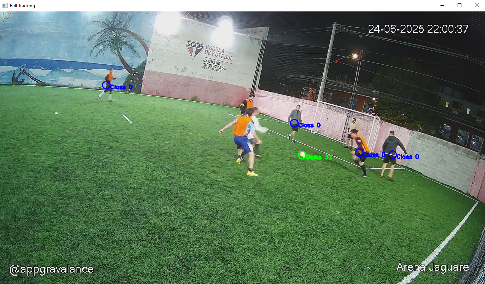

# BallTracking
Simple python code to track the ball in non professional soccer matches.

The final objective is to build an AI companion that controls 2 livestream sources from the matches and changes them based on which has the ball tracked present in the frame.

